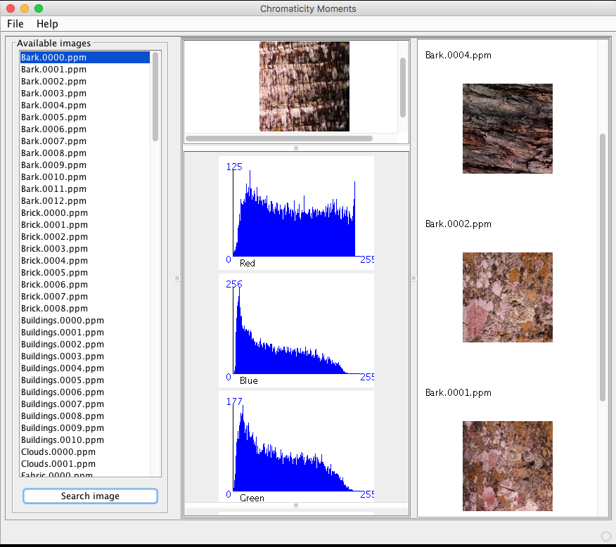

# Chromaticity moments
Implementation of the image retrieval technique described in the paper: "Image content-based retrieval using chromaticity moments".

For evaluation, this repo includes some images from the VisTex database (http://vismod.media.mit.edu/vismod/imagery/VisionTexture/) and a visulization tool.
The visualization tool and algorithms are implemented in Java (Netbeans porject).

 
  

